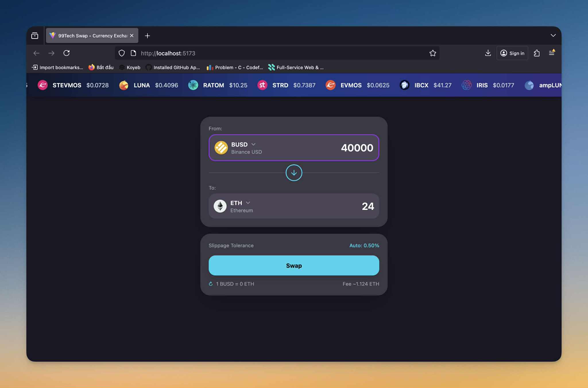

# 99Tech Coding Challenge - Frontend Developer

## 📁 Problem 1: Three ways to sum to n
**Challenge**: Implement 3 different approaches to calculate sum of integers from 1 to n

**Solution**: Iterative, Mathematical (Gauss formula), and Recursive approaches with full documentation and testing.

[📖 View detailed README](./problem1/README.md)

**Run**: `cd problem1 && node index.js`

---

## 📁 Problem 2: Fancy Form
**Challenge**: Build a functional currency exchange interface

**Solution**: Full-stack React/TypeScript application with 100+ tokens, live pricing, and modern UI.

[📖 View detailed README](./problem2/README.md)

**Run**: `cd "problem2" && npm install && npm run dev`

---

## 📁 Problem 3: Messy React
**Challenge**: Identify and fix issues in existing React TypeScript code

**Solution**: Identified 12 issues (bugs, performance, code quality) and refactored to production-ready code.

[📖 View detailed README](./problem3/README.md)
