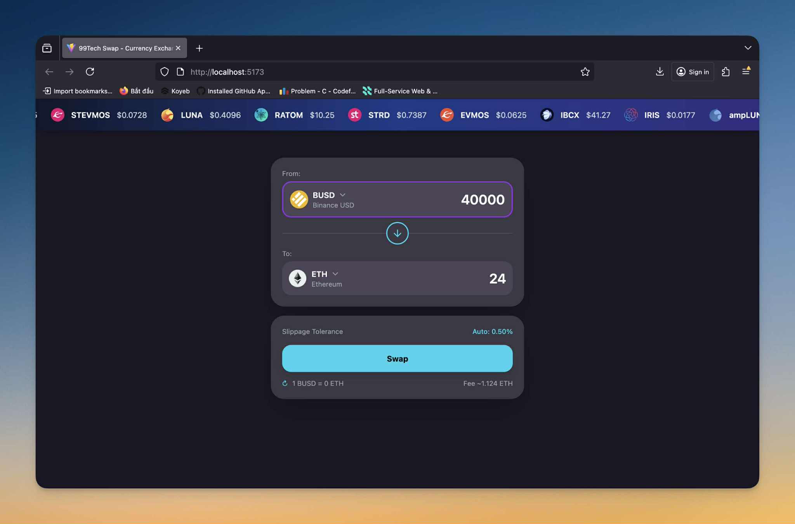

# Problem 2: Currency Swap Form - React Application

## 📋 Challenge
Build a modern, functional currency swap interface for cryptocurrency exchange.



## 🛠️ Tech Stack
- **React 18** with TypeScript
- **Vite** for fast development
- **TailwindCSS** for styling
- **Shadcn/ui** for UI components
- **Custom hooks** for state management
- **API integration** for live pricing

## 🚀 Run the Application
```bash
npm install
npm run dev
```

Then open `http://localhost:5173` in your browser.

## 📐 Architecture Highlights
```
src/
├── components/         # Modular React components
│   ├── CurrencySwapForm.tsx    # Main swap interface
│   ├── TokenSelector.tsx       # Token selection component
│   ├── TokenSelectModal.tsx    # Modal for token search
│   ├── TokenInfoBanner.tsx     # Price ticker banner
│   └── ui/                     # Reusable UI components
├── hooks/              # Custom React hooks
│   └── usePrices.ts   # Real-time price fetching
├── utils/              # Utility functions
│   └── calculations.ts # Swap calculations
├── constants/          # Configuration & data
└── types/              # TypeScript definitions
```
